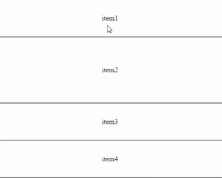

<h1 align="center">React Slipping List</h1>
<h3 align="center"></h3>

<div align="center">

[](https://github.com/semantic-release/semantic-release)


A swipeable and reorderable [`React`](https://facebook.github.io/react/) list component



</div>

## Demo

Experiement with above example on:

[](https://codesandbox.io/s/slippablelist-hm79e)

## Installation

`npm install react-slipping-list`

## Example Usage 

```jsx

import { SlippableList, SlippableListItem, ActionAnimations } from "react-slipping-list";

<SlippableList>
    <SlippableListItem
        key={someId}
        onSwipeLeftEndOverThreshold={()=>{console.log("Triggered!")}}
        onSwipeRightEndOverTreshold={()=>{console.log("Triggered!")}}
        swipeLeftContent={<div>Revealed During Swipe Left</div>}
        swipeRightContent={<div>Revealed During Swipe Right</div>}
    >
        <div>Item Content</div>
    </SlippableListItem>
    <SlippableListItem ... />
    <SlippableListItem ... />
</SlippableList>

```

## Available props 

```{SlippableList, SlippableListItem, and ActionAnimations}``` are exported. 

```<SlippableList/>``` has no props

```<SlippableListItem/>``` accepts many props, allowing list items to have independent trigger thresholds, onStart & onEnd events, swipeLeft & swipeRight revealed contents, etc... See full props list below

Note, for each Prop with "left" in the name, there is a corresponding "right" prop. For example, swipeLeftContent is listed below, so swipeRightContent also exists. 

| Props | Description | Type | Default |
| ----- | ----------- | ---- | ------- |
| swipeLeftContent | content revealed during swipe left | React Element | ```<div />``` |
| swipeLeftThreshold | on swipe end, if percentage swiped exceed this, trigger `onSwipeLeftEndOverThreshold` | 0 <= num <= 1 | 0.5 |
| swipeLeftContentPercentToFullOpacity | percent of list item's width swiped for `swipeLeftContent` to reach full opacity | 0 <= num <= 100  | 25 |
| onSwipeLeftEnd | triggers whenever swipe motion is released  | func | ()=>{} |
| onSwipeLeftEndOverThreshold | triggers when percentage of list item width swiped is greater than the `swipeLeftThreshold`  | func | ()=>{} |
| onSwipeLeftEndOverThresholdAnimation | On swipe over threshold, play a returning, removing, or NO animation  | ActionAnimations.RETURN, ActionAnimations.REMOVE, ActionAnimations.NONE | ActionAnimations.REMOVE |
| onReorderStart  | self explanatory, note, start reordering by holding down an element for 500ms | func | ()=>{} |
| onReorderEnd | self explanatory | func | ()=>{} |
| blockSwipe | list item is not swipeable | bool | false |
| blockReorder | list item does not trigger reorder on after 500ms hold down | bool | false |
| gap | See Caveats, below | num | 0 |

## Caveats

If you desire space between your list items and smooth animations, I find using flexbox + gap, plus setting the `gap` property to gap to be the only, yet incomplete solution so far.

Margins on `<SlippableListItem/>` itself (by overriding the default scss) or on the children of a `<SlippableListItem/>` as a means to create space is not viable. Because, this makes the actual item larger.

So we must create space using the parent element with flexbox + gap. However, this means `<CSSTransition>` can't catch onto the gap, thus not creating the full deletion animation. So, I added `margin-bottom: negative(half of the gap)` to the exit nodes in `<CSSTransition>` and set `transition: margin-bottom 500ms`. This completes the animation, but there is a differentiable lag.

## Acknowledgements

I studied the source code of two well written projects

1. [`react-swipeable-list`](https://github.com/sandstreamdev/react-swipeable-list)
2. [`slip`](https://github.com/kornelski/slip)

I ended up borrowing a lot of syntaxes and implementation details (I never thought that instead of toggling multiple class names, I could directly set class names) from react-swipeable-list. And, for the logic that updates the scrollTop of the list during reordering, I copied directly from `updateScrolling` in slip.js.

I thought this was going to be a sweet one week project to make for my upcoming productivity app (this works well in a todolist). However, it stretched into a whole month in which I spent a good chunk of time learning about CI/CD. I eventually was able to implement [`semantic-release`](https://github.com/semantic-release/semantic-release), and package bundlers plus everything in `package.json` actually makes sense now.

## BUG

If only one node, reorder end calls "removeChild" error

## TODO

1. Gradually drop elements, as in React-Beautiful-DnD
2. Animation speed prop
3. Refactoring
